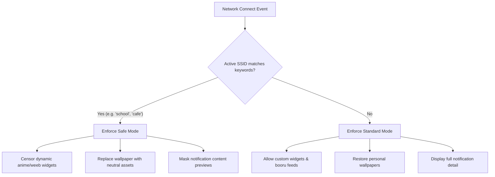

# Adaptive Computing Possibilities

This document analyzes the adaptive features implemented within the host environment and outlines high-potential adaptive possibilities for **Nook Shell**.

---

## 1. Network-Aware Work Safety Censorship

A major human-centric feature in the host configuration is the **Work Safety Monitor** (`workSafety`). Most operating systems treat the user's environment identically whether they are at home in private or working in a crowded public library. The host shell resolves this by tracking environmental metadata to enforce visual privacy:



### The Implementation Logic
Under `config.json`, the environment maintains an SSID and file keyword blacklist:
*   `networkNameKeywords`: `["airport", "cafe", "college", "company", "free", "guest", "public", "school", "university"]`
*   `fileKeywords` / `linkKeywords`: Blacklisted tags that trigger automatic filter mechanisms.

When the network changes, the shell scans the active SSID. If a keyword matches, the shell automatically triggers safe styling overrides, replacing personal/suggestive wallpapers with neutral ones, blocking public Booru image feeds, and hiding detailed notifications to protect the user's privacy in professional settings.

---

## 2. Least-Busy Widget Placement

Overlaid desktop widgets (like large clocks or CPU graphs) frequently collide with user application windows, causing cluttered layouts and unreadable widgets. The environment addresses this with an adaptive **Least-Busy Bounding Box Algorithm**:

1.  **Coordinate Matrix**: The screen is mapped into a logical coordinate grid (e.g., $3 \times 3$ zones).
2.  **Geometry Scoping**: The shell actively reads the size and position of all open windows on the current workspace (via `HyprlandData.windowList`).
3.  **Density Summation**: The algorithm calculates the overlapping surface area of open windows across each grid zone:
    $$\text{Zone Density} = \sum (\text{Window Area} \cap \text{Zone Area})$$
4.  **Widget Translation**: The shell dynamically shifts the desktop clock's $(x, y)$ coordinates to the zone with the lowest density score. If the left side of the screen is full of terminal windows, the clock seamlessly slides to the empty right side of the screen, ensuring optimal readability.

---

## 3. Active Window Contextual Assistant Prompts

The system integrates an AI sidebar assistant (`Ai.qml`) that adjusts its system prompts dynamically based on the user's active window class (`WINDOWCLASS`):

```ini
## Context (ignore when irrelevant)
- You are a helpful and inspiring sidebar assistant on a {DISTRO} Linux system
- Desktop environment: {DE}
- Current date & time: {DATETIME}
- Focused app: {WINDOWCLASS}
```

If the user focuses a terminal window (`kitty`), the AI assistant system prompt updates to prioritize shell scripting advice. If a text editor is active, it shifts focus to writing assistance. This provides context-aware support without requiring the user to manually type out their active workspace state.

---

## 4. Future Adaptive Opportunities for Nook Shell

Nook Shell can expand on these principles to build a truly human-centric desktop workspace:

1.  **Project-Aware Workspace Restoration**: Integrate the shell with local development environments. When the user opens a terminal inside a specific project folder, the shell automatically restores related IDE windows, API document tabs, and database monitors to their designated workspaces, resuming their exact spatial flow.
2.  **Context-Aware Notification Routing**: Instead of relying on a binary "Do Not Disturb" toggle, Nook can track the user's input speed and active applications. If the user is typing actively in an IDE (`code`) or terminal, the shell suppresses low-priority notifications. If the user stops typing or switches to a casual browser window, the shell gently surfaces the queued notifications.
3.  **Intelligent Resource Allocation**: If a critical application (like compiling code or rendering video) is active, the shell automatically suspends visual QML widgets, wallpaper animations, and auxiliary network monitors, dedicating all system resources to the active task.
