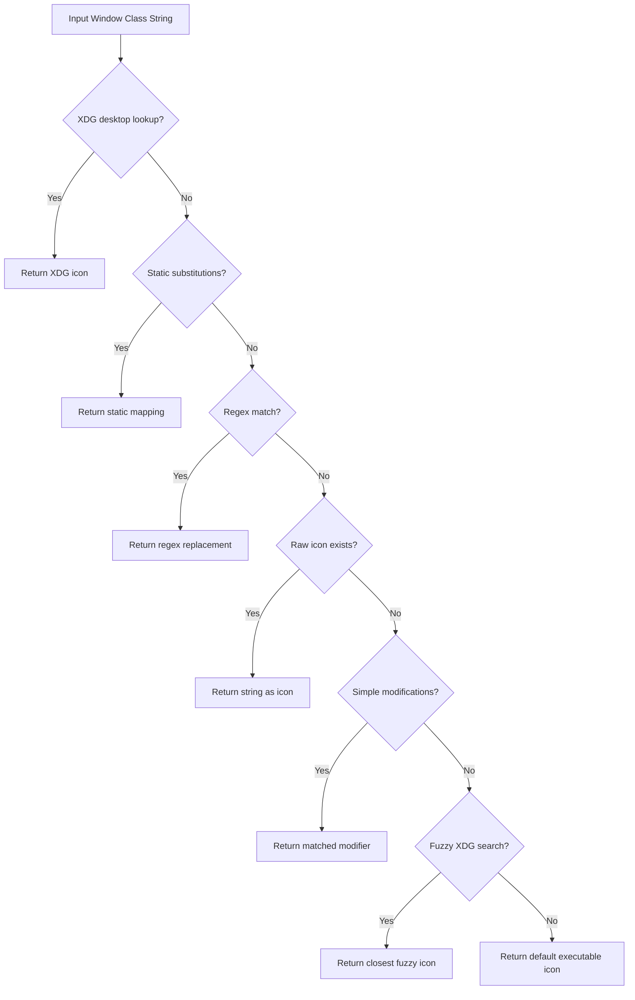

# Launcher Architecture Patterns

This document details the application launcher architecture of the host shell, including XDG desktop entry fuzzy indexing, input prefix routing, dynamic application icon guessing, and its resilient fallback mechanisms.

---

## 1. Fuzzy Application Indexing

The shell leverages Quickshell's native XDG integration to index all system desktop shortcuts. In `services/AppSearch.qml`, it fetches desktop entries:

```qml
readonly property list<DesktopEntry> list: Array.from(DesktopEntries.applications.values)
    .filter((app, index, self) => 
        index === self.findIndex((t) => (t.id === app.id))
    )
```

### Search Engines
1.  **Fuzzy Module**: By default, search queries are prepared and routed to a specialized `Fuzzy` matching engine (`Fuzzy.go`) which grades matching items.
2.  **Sloppy Search (Levenshtein Distance)**: If enabled via `config.json`, the shell utilizes a custom Levenshtein distance algorithm (`Levendist.computeScore`) to calculate visual similarities, sorting scores descending:
    ```js
    const score = Levendist.computeScore(obj.name.toLowerCase(), search.toLowerCase())
    ```

---

## 2. Resilient Fallback Mechanics

Rather than leaving the launcher vulnerable to runtime crashes, keybindings are constructed symmetrically. If the high-level QML shell crashes, the user still retains launcher capabilities via fallback shell triggers:

```ini
# Primary binding targets Quickshell IPC
bindid = Super, Super_L, Toggle search, global, quickshell:searchToggleRelease

# Fallback binding triggers if Quickshell is unreachable
bind = Super, Super_L, exec, qs -c $qsConfig ipc call TEST_ALIVE || pkill fuzzel || fuzzel
```

If `qs ipc call TEST_ALIVE` exits with a non-zero code (indicating the Quickshell server is dead or unresponsive), the compositor immediately triggers `fuzzel` (a highly efficient, lightweight C-based Wayland launcher). This tiered safety model ensures the system remains navigable under all circumstances.

---

## 3. Semantic Input Prefixing

Rather than operating as a simple application finder, the launcher incorporates a powerful **Semantic Prefix Parser**. Based on the first character typed in the query box, input is dynamically routed to specialized subsystems:

| Prefix | Subsystem Target | Action / Output |
| :---: | :--- | :--- |
| `>` | App Finder | Filters applications by XDG desktop entry name. |
| `/` | Actions | Triggers system commands (Lock, Sleep, Reboot, Poweroff). |
| `;` | Clipboard | Fuzzy-searches through historical text segments copied to the clipboard. |
| `:` | Emojis | Selects emojis, copying the selection instantly to the keyboard buffer. |
| `=` | Calculator | Evaluates mathematical equations inline, copying results on press. |
| `$` | Terminal | Runs the query directly inside a shell process, surfacing stderr/stdout. |
| `?` | Search Engine | Diverts the query string directly to a web search engine or Google Lens. |

---

## 4. Multi-Layered Icon Guessing Heuristic

When new application windows are created, Hyprland reports their active window `class` (e.g. `code-url-handler`, `gnome-tweaks`, `steam_app_1046930`). Because these classes frequently mismatch actual XDG `.desktop` icon filenames, the shell implements a highly progressive **Icon Guessing State Machine**:



### Guessing Layers
1.  **Direct Desktop Mapping**: Checks if the string matches an application ID (`DesktopEntries.byId(str)`).
2.  **Static Substitution Dictionary**: Consults hardcoded substitution lists (e.g., mapping `gnome-tweaks` to `org.gnome.tweaks`).
3.  **Regex Override Rules**: Translates dynamic classes like `steam_app_1046930` to `steam_icon_1046930`.
4.  **Raw File Probing**: Checks if the raw string represents an active theme icon using `Quickshell.iconPath`.
5.  **String Normalization**: Mutates the string sequentially and probes the theme:
    *   Converts to lowercase.
    *   Extracts reverse domain names (e.g., `org.gnome.builder` -> `builder`).
    *   Normalizes space layouts to kebab-case (e.g., `my app` -> `my-app`).
    *   Converts underscores to hyphens (e.g., `application_name` -> `application-name`).
6.  **Fuzzy Similarity Check**: Runs a fuzzy-search against all indexed application names and icons to pick the closest visual match.
7.  **Terminal Fallback**: If all attempts fail, returns a generic `"application-x-executable"` glyph.
