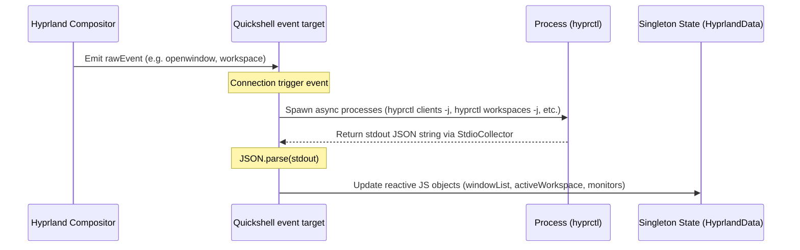
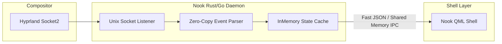

# Quickshell Integration Patterns

This document details how the current shell integrates with the **Quickshell** runtime, binds to Wayland and Hyprland API surfaces, manages system state, and highlights major architectural optimization opportunities.

---

## 1. Core Binding API Structures

Quickshell operates as a native QML runtime with specialized bindings for Wayland and compositor-specific APIs. In the entrypoint (`shell.qml`), the shell is initialized using the `ShellRoot` container:

```qml
import Quickshell
import Quickshell.Io
import Quickshell.Hyprland

ShellRoot {
    id: root
    // Initialization, services, and dynamic panel loaders are defined here
}
```

Key integration components include:
*   **`IpcHandler`**: Allows external scripts or keybinds to invoke internal shell functions via the shell command line. For example, running `quickshell ipc panelFamily cycle` maps to an `IpcHandler` in QML:
    ```qml
    IpcHandler {
        target: "panelFamily"
        function cycle(): void {
            root.cyclePanelFamily()
        }
    }
    ```
*   **`GlobalShortcut`**: Registers native compositor keyboard shortcut listeners directly from within QML:
    ```qml
    GlobalShortcut {
        name: "panelFamilyCycle"
        onPressed: root.cyclePanelFamily()
    }
    ```

---

## 2. The Hybrid IPC State-Pull Loop

One of the most critical parts of the shell's state management exists inside `services/HyprlandData.qml`. Because Quickshell does not expose full window and monitor properties natively through QML elements, the shell implements a **Hybrid IPC Event-Pull** pattern:



### Analysis of the State-Pull Implementation
*   **Raw Event Listening**: The shell hooks into Hyprland's socket events:
    ```qml
    Connections {
        target: Hyprland
        function onRawEvent(event) {
            if (["openlayer", "closelayer", "screencast"].includes(event.name)) return;
            updateAll()
        }
    }
    ```
*   **Asynchronous Process Forking**: Whenever any monitored raw event occurs, `updateAll()` is triggered, running several asynchronous shell processes simultaneously:
    *   `hyprctl clients -j`
    *   `hyprctl monitors -j`
    *   `hyprctl layers -j`
    *   `hyprctl workspaces -j`
    *   `hyprctl activeworkspace -j`
*   **Data Parsing**: Each process pipes its stdout into a `StdioCollector` which calls `JSON.parse()` to update state properties.

---

## 3. Performance Overhead & Anti-Patterns

While this hybrid approach successfully extracts full workspace data, it introduces serious architectural anti-patterns:

1.  **Process Fork Storms**: Spawning up to **5 system processes** (`hyprctl`) on *every single* window open, close, focus switch, or workspace navigation creates substantial CPU overhead and process-creation lag. On low-power hardware, this causes visible micro-stuttering during animations.
2.  **Repetitive JSON Parsing**: Running heavy `JSON.parse` loops on massive clients/windows arrays (often containing hundreds of keys) inside a single-threaded Javascript context blocks the main UI rendering thread, causing dropped animation frames.
3.  **Race Conditions**: Asynchronous commands return out of order. If workspace switches occur in rapid succession, a slower process query may populate the shell state with outdated details.

---

## 4. Nook Shell Optimization Opportunities

To achieve a premium, high-fidelity experience, **Nook Shell** must avoid this process-spawning loop entirely. 

### Proposed Nook IPC Cache Architecture

Rather than executing `hyprctl` binaries continually, Nook will introduce a dedicated, zero-copy, event-driven state cache:



1.  **Persistent Socket Listener**: Build a lightweight, persistent background daemon (written in Rust or Go) that listens directly to Hyprland's Unix socket `/tmp/hypr/$HYPRLAND_INSTANCE_SIGNATURE/.socket2.sock`.
2.  **Incremental State Tracking**: The daemon maintains a clean, in-memory tree of active windows, monitors, and workspaces. Instead of rebuilding state from scratch, it updates the tree incrementally based on socket events (e.g., `openwindow>>...` adds a window node; `closewindow>>...` removes it).
3.  **Low-Latency IPC**: The shell simply queries this daemon's memory cache via a fast, long-lived local socket, or receives tiny, incremental JSON update packets, completely avoiding the creation of heavy sub-processes and large-scale JSON parsing.
