# Current Shell Architecture Breakdown

This document breaks down the structural design, configuration organization, and layered subsystems of the host environment based on **Hyprland** and **Illogical Impulse**.

---

## 1. Modular Sourcing Architecture

The current setup utilizes a layered, cascading sourcing mechanism within `~/.config/hypr/hyprland.conf`. Rather than consolidating all directives into a single bloated config file, configurations are segmented into logical namespaces.

```mermaid
graph TD
    hc[hyprland.conf] --> env_h[hyprland/env.conf]
    hc --> env_c[custom/env.conf]
    hc --> var_h[hyprland/variables.conf]
    hc --> var_c[custom/variables.conf]
    hc --> exec_h[hyprland/execs.conf]
    hc --> exec_c[custom/execs.conf]
    hc --> gen_h[hyprland/general.conf]
    hc --> gen_c[custom/general.conf]
    hc --> rule_h[hyprland/rules.conf]
    hc --> rule_c[custom/rules.conf]
    hc --> key_h[hyprland/keybinds.conf]
    hc --> key_c[custom/keybinds.conf]
    hc --> work_nwg[workspaces.conf / monitors.conf]
    hc --> shell_o[hyprland/shellOverrides/main.conf]
```



### Cascading Configuration Execution
1.  **Environment Setup**: Sources `hyprland/env.conf` and `custom/env.conf`. Sets Wayland/QT environment paths.
2.  **Variable Initialization**: Sources variables (e.g., active styling variables, basic gap widths) from default and custom paths.
3.  **Compositor Rules**: Sources window properties and layout behavior.
4.  **Autostart Elements (`execs.conf`)**: Spawns core system daemons (dbus, polkit, pipewire, gesture daemons, and quickshell).
5.  **User Keybindings**: Binds keys to compositor dispatcher rules or external scripts.
6.  **Dynamic Overrides**: Loads `hyprland/shellOverrides/main.conf` at the absolute bottom.

> [!NOTE]
> The dynamic override pattern is highly semantic. By sourcing `shellOverrides/main.conf` at the very end, any values populated in this file automatically supersede the defaults and custom configs above it. This allows the Shell Layer (Quickshell) to mutate the compositor's active layout (gaps, border colors, active layouts) at runtime by rewriting this override file and calling `hyprctl reload`.

---

## 2. Major Shell Subsystems

The current environment operates through the close coordination of five major subsystems:

| Subsystem | Responsibilities | Technologies |
| :--- | :--- | :--- |
| **Compositor Engine** | Intercepts keyboard/mouse inputs, renders windows, routes hardware outputs, and provides window manager layout engines. | Hyprland |
| **Shell UI Layer** | Renders dynamic system overlays, docks, status bars, launchers, sidebar panels, and interactive notifications. | Quickshell (QtQuick / QML) |
| **Workspace Orchestrator** | Manages numerical workspace grids, paginated navigation, and multi-monitor layouts. | Bash scripts (`workspace_action.sh`) & JQ |
| **System Event/IPC Bus** | Connects standard CLI calls to the shell runtime and distributes compositor state events to QML widgets. | Unix Sockets, Quickshell IPC, and D-Bus |
| **Style & Theme Manager** | Dynamically extracts colors from active wallpapers and rebuilds QT, GTK, and shell styling profiles at runtime. | Matugen, Kvantum, Python scripts |

---

## 3. Physical and Logical Layer Modeling

In a modern Wayland environment, visual components are managed according to the **Wayland Layer-Shell Protocol**. This determines the depth (z-index) at which various windows are rendered relative to application clients.

The Illogical Impulse shell maps components to the following four physical layers:

```
[Screen Foreground]
       │
       ▼  (Z-Depth: 3) Overlay Layer    ──► Launchers, Lockscreen, Alerts, OSD
       │
       ▼  (Z-Depth: 2) Top Layer        ──► Status Bars, Sidebars, System Docks
       │
       ▼  (Z-Depth: 1) Client Workspace ──► User Applications (Terminal, Browser, IDE)
       │
       ▼  (Z-Depth: 0) Bottom/Background──► Wallpapers, Least-Busy Clock Widgets
       │
[Screen Background]
```

### Layer Breakdown

1.  **Background / Bottom Layer**:
    *   *Usage*: Renders the system wallpaper and dynamic desktop widgets (clocks, ambient usage graphs).
    *   *Behavior*: Receives no active input focus. Completely covered by standard client applications.
2.  **Top Layer**:
    *   *Usage*: Renders the primary status bar, system docks, and slide-out sidebars (AI assistant, settings).
    *   *Behavior*: Persists on the screen borders or auto-hides. Can receive input when interacted with, but generally sits alongside standard application windows.
3.  **Overlay Layer**:
    *   *Usage*: Renders full-screen application launchers, pop-up session menus, volume/brightness OSDs, and critical warning alerts.
    *   *Behavior*: Grabs active input focus immediately when summoned. Suspends standard window interactions until dismissed.
